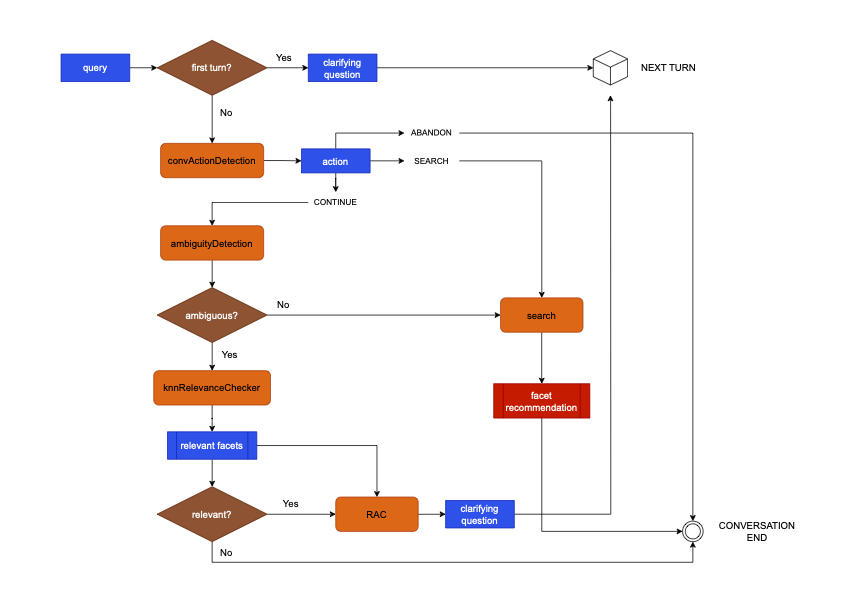

# Backend

## Table of Contents
- [Code Structure](#code-structure)
- [Prompting Graph](#prompting-graph)
- [RAG](#deployment)
- [Miscellaneous](#miscellaneous)

---

## Code Structure
```app/
│
├─ README.md           ← 项目介绍
├─ assets/             ← 存放图片等资源
│   ├─ demo.png
│   └─ logo.png
│
├─ module1/            ← 模块1，主要实现XXX功能
│   ├─ README.md       ← 模块说明文档
│   └─ code.py         ← 模块代码


## Prompting Graph
Here is the overview of prompting graph for the chat mode:



The prompting graph consists of several nodes:
- 
